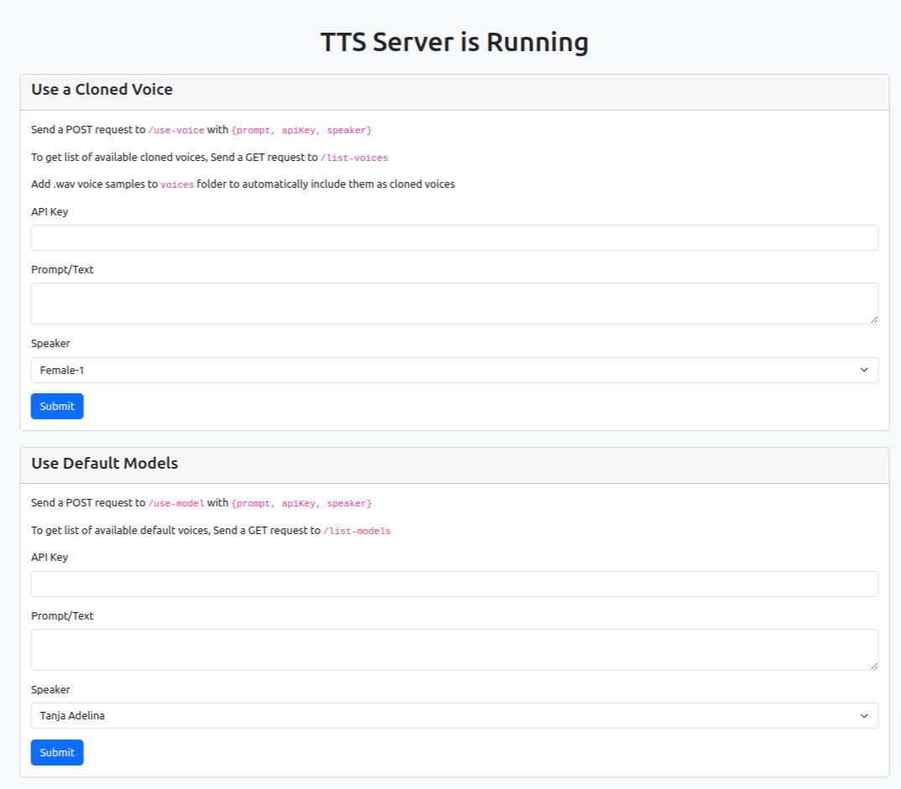

# Docker-TTS-API

### AI text-to-speech and XTTS-2 Text-Based Voice Cloning

Docker container for xttsV2 with API, UI & voice cloning.
This project is based on Coqui-TTS to make AI text to speech and voice cloning simple to install using docker.
Seeing that most AI projects require python sknowledge to deploy, i decided to write use NodeJS/Javascript to create a simple to use AI Text to speech API. If you clone good quality voices, you'll get eleven labs quality. I found out that using 10 minutes of continous speech as a voice to clone gave me amazing Eleven labs quality results. You can clone with as short as 60 seconds audio but i found 10 minutes as the sweet spot that gave me the best results. Use [podcast.adobe.com/enhance](https://podcast.adobe.com/enhance) to clean any audio you want to clone.

## Installation

After installation, the TTS engine may take some time to start up as it needs to download the models. This is one-time only.

```sh
git clone https://github.com/lojik-ng/docker-tts-api-ui.git
cd docker-tts-api-ui
rename server/keys.sample.json server/keys.json
docker build -t docker-tts-api-ui .
docker run -d -it -p 2902:2902 --gpus all  --restart=unless-stopped -v .:/shared -v ./models:/root/.local/share/tts --name docker-tts-api-ui docker-tts-api-ui
```

You can now access the ui at `http://localhost:2902/`.

<h1 align="center">    
  </a>  
</h1>

### Endpoints/API

- To get list of available default voice models, Send a GET request to `http://localhost:2902/list-models`
- To get list of available clone voices, Send a GET request to `/list-voices`
- To use a default voice model, send a POST request to `http://localhost:2902/use-model` with `{prompt: string, apiKey: string, speaker: string, forceDownload: boolean}`
- To generate with a cloned voice, send a POST request to `http://localhost:2902/use-voice` with `{prompt: string, apiKey: string, speaker: string, forceDownload: boolean}`
- Check server/index.html for example usage of the endpoints
- forceDownload will make the server return a downloadable stream if true or json with filename property if false. (See server/index.html)

### Voice Cloning

- To clone a voice, copy a .wav audio file of the voice into /voices folder in the cloned repository. The docker container will use it from there.
- The filename of the audio file (without the extension - .wav) becomes the name of the cloned voice automatically.
- The list endoint of clone voice will automatically list it among available cloned voices.

### API Keys/Authentication

- Edit /server/keys.json in the cloned repository anytime to add or remove API keys.

### Logging

- logs are rotated daily and can be found in /logs folder of the cloned repository.
- Logs are never purged. You'll need to manually purge the logs.
- Access logs, error logs etc are lumped together

### Features

- Requires GPU. I tested with Nvidia GPU (Cuda). I dont have AMD gpu to test.
- Not intended for parallel generation. I didnt test with parallel generation.
- API is written in NodeJS so should be easy for JS devs to modify. Check `server/index.js`.
- Returns mp3 files. I bundled it with ffmpeg to convert the generated .wav file into mp3 before sending. If you prefer .wav or any other audio file type, modify `server/index.js`
- Authentication: You can add as many users and ban users just by editing the `server/keys.json` file.
- Logging: It logs all user requests, errors etc.

## Credits

- This software uses libraries from the [FFmpeg](http://ffmpeg.org) project under the [LGPLv2.1](http://www.gnu.org/licenses/old-licenses/lgpl-2.1.html)
- This software uses [Coqui TTS](https://github.com/coqui-ai/TTS)
